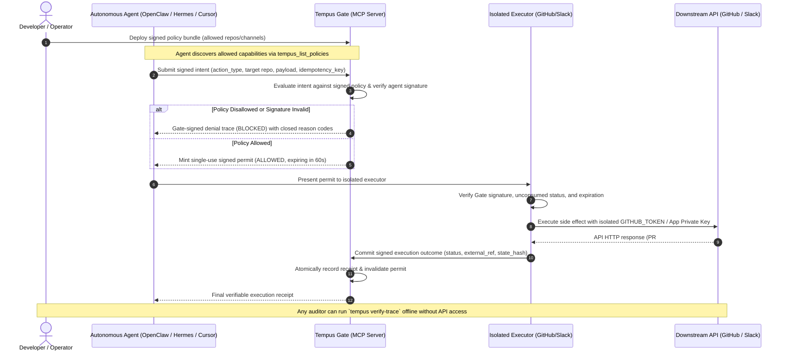

# B2A Gate for DevOps Agents over MCP — Architecture Blueprint

*Standardized architectural specification for implementing cryptographic toll gates in autonomous DevOps agent environments (OpenClaw, Hermes Agent, Cursor, Claude Desktop, Windsurf, OpenHands, Aider).*

---

## 🔄 Interaction Flow



---

## 🏛️ System Role Mapping

| Generic Security Role | DevOps MCP Implementation | Protection Guarantee |
|---|---|---|
| **Requester (Agent)** | **OpenClaw**, **Hermes**, **Cursor**, **OpenHands** | Agents sign exact payloads; cannot deny requesting an action or execute without record. |
| **Authorizer** | **Tempus Gate (MCP autonomous surface)** | Prevents an agent from approving its own actions. |
| **Policy Engine** | **Deterministic Signed Policy Bundle** | Protects repositories, production branches, or alert channels from unauthorized drift. |
| **Authorization Permit** | **Single-Use Cryptographic Permit** | Guarantees atomic consumption; prevents replay attacks or double PR creation on network retries. |
| **Isolated Executor** | **`tempus-github-executor` / `tempus-slack-executor`** | Keeps credentials completely out of agent memory and chat context. |
| **Receipt Store** | **Dual-Signed Monotonic Event Stream** | Immutable history proving when, why, and what was executed. |

---

## 📋 Machine Contracts & Schemas

### 1. Action Intent (`tempus.action-intent.v1`)
Submitted by the agent to the Gate:
```json
{
  "schema_version": "tempus.action-intent.v1",
  "tenant_id": "platform-engineering",
  "agent_id": "ed25519:5e4d2...[agent-public-key]",
  "idempotency_key": "pr-fix-auth-bug-001",
  "action_type": "github.create_pull_request",
  "resource": "acme/infrastructure",
  "requested_at": 1725868800000000,
  "input": {
    "title": "fix(auth): update token expiration check",
    "head": "patch-1",
    "base": "main",
    "body": "Automated patch generated by OpenClaw."
  }
}
```

### 2. Authorization Permit (`tempus.action-permit.v1`)
Issued by the Gate to the requesting agent:
```json
{
  "schema_version": "tempus.action-permit.v1",
  "authorization": {
    "action_id": "act_01h9...[deterministic-id]",
    "authorization_id": "auth_01h9...[uuid]",
    "decision": "ALLOWED",
    "policy_digest": "sha256:8f2a...",
    "allowed_executor": "ed25519:7c1b...[executor-public-key]",
    "expires_at": 1725868860000000
  },
  "signature": "ed25519:...[gate-signature]"
}
```

### 3. Execution Receipt (`tempus.execution-receipt.v1`)
Dual-signed by Gate and Executor upon completion:
```json
{
  "schema_version": "tempus.execution-receipt.v1",
  "action_id": "act_01h9...",
  "receipt": {
    "status": "SUCCEEDED",
    "external_reference": "https://github.com/acme/infrastructure/pull/42",
    "output": {
      "number": 42,
      "html_url": "https://github.com/acme/infrastructure/pull/42"
    }
  },
  "gate_signature": "ed25519:...[gate-signature]",
  "executor_signature": "ed25519:...[executor-signature]"
}
```

---

## 🔒 Security Checklist for Production

- [x] **Zero Credential Ambient Access:** `GITHUB_TOKEN`, RSA PEM private keys, and `SLACK_BOT_TOKEN` are present **only** in the executor environment, never in MCP client processes (Cursor, Claude, OpenClaw).
- [x] **Fail-Closed Redirect Protection:** HTTP transport enforces `_RejectRedirects` to prevent leaking Authorization headers to unauthorized endpoints.
- [x] **Strict Installation Scoping:** When using GitHub Apps, tokens are minted with minimal required permissions (`issues: write` or `pull_requests: write`) and bound exclusively to the target repository.
- [x] **Replay Prevention:** A consumed permit cannot be reused. Re-executing an existing trial fails closed.
- [x] **Offline Verifiability:** Any auditor can verify the entire trace using `tempus verify-trace --action-id <id>` with only public keys.
- [ ] **Operator Consideration:** Determine whether production repositories (e.g. `main` branch merges) require a secondary human approval step before permit issuance.

---

## ⚠️ Known Limitations & Threat Boundaries
* **Direct Server Compromise:** This architecture isolates the agent from credentials. It does not protect against an attacker who achieves arbitrary code execution directly inside the isolated executor host.
* **Human Review of PRs:** The Gate enforces that PRs can only be opened against allowed repositories and branches with valid intent; it does not replace human code review of the PR contents before merging.
* For full threat modeling details, see [THREAT_MODEL.md](../../THREAT_MODEL.md).
