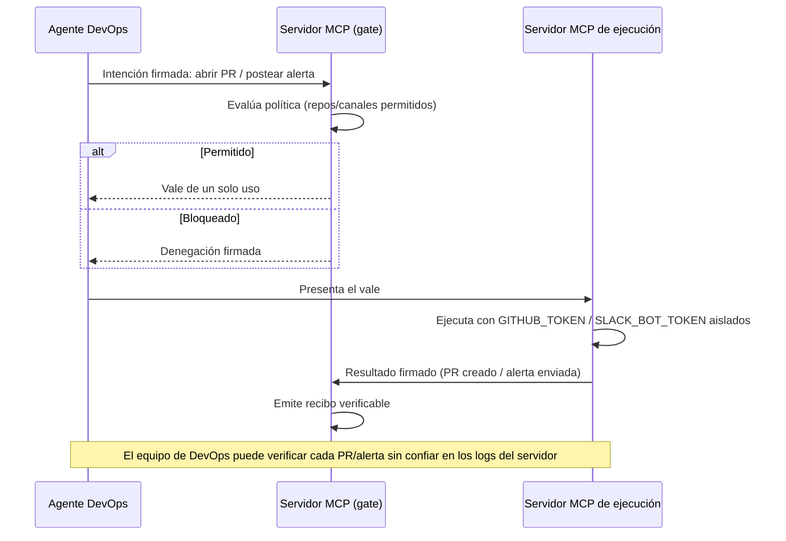

# Gate B2A para Agente DevOps sobre MCP — Blueprint de arquitectura

*Patrón B2A generalizado a partir de [tempus-ddb](https://github.com/elbuilder77/tempus-ddb), aplicado a un servidor MCP propio con acciones de GitHub PR y alertas de Slack.*

## Diagrama de flujo

## Tabla de mapeo

| Rol genérico | Nombre en este sistema | Qué protege |
|---|---|---|
| Solicitante | Agente DevOps | Que el agente actúe sobre GitHub/Slack sin dejar constancia exacta de qué pidió |
| Autorizador | Servidor MCP (gate) | Que el agente apruebe su propia acción de escritura |
| Motor de política | Política de repos/canales permitidos | Repos o canales fuera de alcance, o reglas cambiadas a mitad de camino |
| Vale de autorización | Vale de acción de un solo uso | Doble apertura del mismo PR o doble envío de la misma alerta por reintento |
| Ejecutor aislado | Servidor MCP de ejecución (GitHub/Slack) | Que el agente tenga `GITHUB_TOKEN` o `SLACK_BOT_TOKEN` directamente |
| Recibo verificable | Recibo firmado por PR/alerta | Que el historial de acciones se pueda alterar después del hecho |

## Contratos (adaptados de `references/generic-contracts.md`)

- **Intención de acción:** `agente_id`, `tipo_de_accion` (`github.crear_pr` / `slack.enviar_alerta`), `recurso` (`owner/repo` o canal), `entrada` (título/body/labels o mensaje), `clave_de_idempotencia`.
- **Resultado de autorización:** `decision`, `id_de_autorizacion`, `huella_de_politica`, `expira_en`, `ejecutor_permitido`.
- **Resultado de ejecución:** `estado` (`EXITOSO`/`FALLIDO`), `referencia_externa` (número de PR o timestamp del mensaje), `salida`.
- **Recibo de ejecución:** firma conjunta gate + ejecutor.
- **Traza de acción:** unión completa, verificable offline.

## Checklist de seguridad

- [x] El agente DevOps nunca tiene `GITHUB_TOKEN` ni `SLACK_BOT_TOKEN`.
- [x] La política de repos/canales permitidos es determinista y firmada.
- [x] Un vale consumido no puede reutilizarse (evita doble PR / doble alerta).
- [x] Los vales expiran.
- [x] Fail-closed por defecto.
- [x] Todo PR o alerta, exitoso o fallido, produce un recibo firmado.
- [ ] *Pendiente de decidir por el equipo:* si además de la autorización automática, ciertos repos requieren un paso de revisión humana antes del vale.
- [ ] *Pendiente:* qué tools administrativas (creación de identidades, rotación de tokens) quedan fuera del servidor MCP de cara al agente.

## Notas de adaptación

- **Servidor MCP propio:** exactamente el "modo autónomo" que describe tempus-ddb — el servidor que ve el agente expone solo operaciones de autorización/lectura firmadas (`solicitar_accion`, `obtener_traza`, `verificar_traza`, `listar_agentes`, `listar_politicas`), nunca tools administrativas, heredadas, destructivas o que acepten rutas de archivos de claves locales; esas quedan detrás de flags separados y de un proceso de aprovisionamiento aparte.
- Los ejecutores de GitHub y Slack de tempus-ddb (`tempus-github-executor`, `tempus-slack-executor`) ya implementan el rol de "servidor MCP de ejecución" descrito arriba, si el equipo prefiere no escribirlos desde cero.

## Límites conocidos a la fecha de este blueprint

Este patrón no reemplaza la revisión humana de los PRs una vez abiertos, ni protege contra alguien con acceso directo al proceso de ejecución (fuera del agente) que abuse de los tokens. Verifica `THREAT_MODEL.md` de tempus-ddb con `web_fetch` si necesitas la lista de límites más actual.
