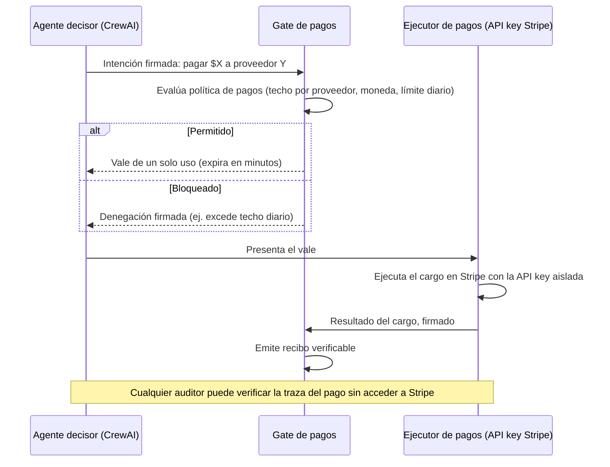

# Gate de Pagos B2A para CrewAI — Blueprint de arquitectura

*Patrón B2A generalizado a partir de [tempus-ddb](https://github.com/elbuilder77/tempus-ddb), aplicado a un crew de CrewAI que paga proveedores vía Stripe.*

## Diagrama de flujo

## Tabla de mapeo

| Rol genérico | Nombre en este sistema | Qué protege |
|---|---|---|
| Solicitante | Agente decisor CrewAI | Que el agente decisor mueva dinero sin dejar constancia exacta del monto y proveedor pedidos |
| Autorizador | Gate de pagos | Que el agente decisor apruebe su propio pago |
| Motor de política | Política de pagos firmada | Techos de gasto o proveedores cambiados a mitad de camino |
| Vale de autorización | Vale de pago de un solo uso | Que el mismo pago se dispare dos veces por un reintento |
| Ejecutor aislado | Ejecutor de pagos (Stripe) | Que el agente decisor tenga la API key de Stripe |
| Recibo verificable | Recibo de pago firmado | Que el historial de pagos se pueda alterar después del hecho |

## Contratos (adaptados de `references/generic-contracts.md`)

- **Intención de pago:** `agente_decisor_id`, `proveedor_id`, `monto`, `moneda`, `concepto`, `clave_de_idempotencia`, `momento_de_la_solicitud`.
- **Resultado de autorización:** `decision` (`PERMITIDO`/`BLOQUEADO`), `id_de_autorizacion`, `huella_de_politica`, `expira_en`, `ejecutor_permitido` (solo el ejecutor de pagos).
- **Resultado de ejecución:** `id_de_autorizacion`, `estado` (`EXITOSO`/`FALLIDO`), `referencia_stripe` (id del cargo), `salida`.
- **Recibo de pago:** firma conjunta gate + ejecutor, ata intención → autorización → resultado.
- **Traza de pago:** unión completa, verificable offline, con veredicto `VERIFICADO`/`INVÁLIDO`.

## Checklist de seguridad

- [x] El agente decisor CrewAI nunca tiene la API key de Stripe.
- [x] La política de techos de gasto es determinista y está versionada/firmada.
- [x] Un vale de pago consumido no puede reutilizarse.
- [x] Los vales expiran en minutos, no viven indefinidamente.
- [x] Fail-closed: si el gate no puede evaluar la política, el pago no ocurre.
- [x] Todo cargo, exitoso o fallido, produce un recibo firmado por gate y ejecutor.
- [ ] *Pendiente de decidir por el equipo:* verificación independiente de trazas (¿quién audita, con qué frecuencia?).
- [ ] *Pendiente:* plan explícito para cargos que quedan en estado ambiguo tras un reinicio del ejecutor (evitar reintento ciego).

## Notas de adaptación

- **CrewAI:** el gate se implementa como una tool custom ("solicitar_pago") que el agente decisor invoca en vez de tener acceso directo a una tool de Stripe. La tool de Stripe real solo existe del lado del ejecutor de pagos, fuera del proceso del crew.
- Si el equipo prefiere no construir el ejecutor desde cero, `tempus-payment-executor` (parte de tempus-ddb) ya implementa este rol con un transporte de pagos "traiga su propio proveedor" (`PaymentTransport`), donde conectar el cliente real de Stripe sin exponer la clave al agente.

## Límites conocidos a la fecha de este blueprint

El ejecutor de pagos sigue siendo el punto que sostiene la credencial real de Stripe — este patrón reduce quién puede iniciar un cargo, no elimina el riesgo de que el ejecutor mismo sea comprometido. Verifica `THREAT_MODEL.md` de tempus-ddb con `web_fetch` si necesitas la lista de límites más actual.
