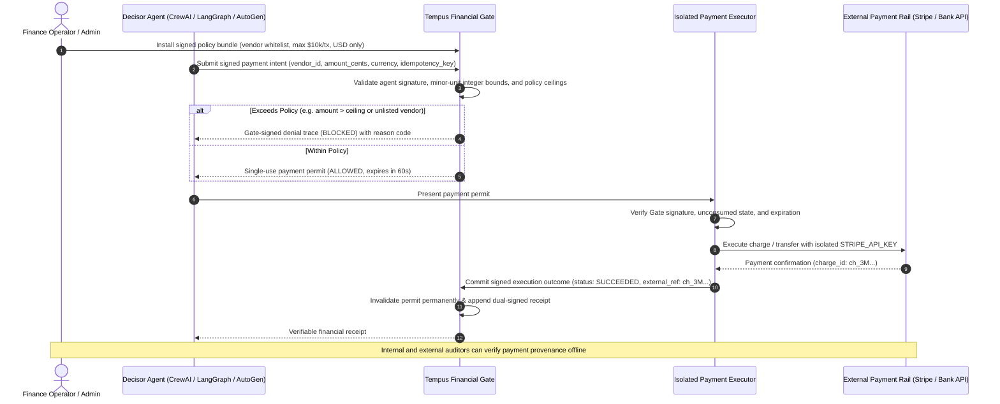

# B2A Financial Gate for Multi-Agent Crews — Architecture Blueprint

*Standardized architectural specification for implementing cryptographic toll gates in autonomous financial multi-agent systems (CrewAI, LangGraph, AutoGen, OpenClaw, Hermes Agent).*

---

## 🔄 Interaction Flow



---

## 🏛️ System Role Mapping

| Generic Security Role | Financial Implementation | Protection Guarantee |
|---|---|---|
| **Requester (Decisor)** | **CrewAI Decisor / LangGraph Node** | Signs the payment request; cannot deny requesting the transfer. |
| **Authorizer** | **Tempus Financial Gate** | Prevents an agent from approving its own disbursement. |
| **Policy Engine** | **Signed Money Policy Bundle** | Enforces hard minor-unit spending limits, vendor whitelists, and daily rate ceilings. |
| **Payment Permit** | **Single-Use Cryptographic Permit** | Protects against duplicate charges, double-spending, and network replay attacks. |
| **Isolated Executor** | **`tempus-payment-executor`** | Holds `STRIPE_API_KEY` in an isolated process; inaccessible to agents. |
| **Financial Receipt** | **Dual-Signed Monotonic Receipt** | Immutable audit trail binding intent, approval, and external transaction ID. |

---

## 📋 Machine Contracts & Schemas

### 1. Payment Intent with Universal Money Contract (`tempus.action-intent.v1`)
Submitted by the Decisor Agent to the Gate:
```json
{
  "schema_version": "tempus.action-intent.v1",
  "tenant_id": "corporate-treasury",
  "agent_id": "ed25519:3b2a...[agent-public-key]",
  "idempotency_key": "inv-2026-09-vendor-acme",
  "action_type": "payment.disburse",
  "resource": "stripe/connected-accounts/acct_12345",
  "requested_at": 1725868800000000,
  "input": {
    "recipient_id": "vendor_acme_corp",
    "invoice_number": "INV-99824",
    "notes": "Approved Q3 infrastructure billing"
  },
  "money": {
    "amount_minor_units": 450000,
    "currency": "USD"
  }
}
```

> **Why Minor Units?** All amounts are strictly expressed as non-negative integers representing the currency's smallest unit (e.g. cents for USD, yen for JPY). Floating-point values are rejected at the Gate schema level to eliminate precision loss.

### 2. Financial Permit (`tempus.action-permit.v1`)
Issued by the Gate:
```json
{
  "schema_version": "tempus.action-permit.v1",
  "authorization": {
    "action_id": "act_pay_01h9...",
    "authorization_id": "auth_pay_01h9...",
    "decision": "ALLOWED",
    "policy_digest": "sha256:7e11...",
    "allowed_executor": "ed25519:9f8e...[executor-public-key]",
    "expires_at": 1725868860000000,
    "money_ceiling": {
      "max_minor_units": 500000,
      "currency": "USD"
    }
  },
  "signature": "ed25519:...[gate-signature]"
}
```

### 3. Financial Execution Receipt (`tempus.execution-receipt.v1`)
Dual-signed by Gate and Executor:
```json
{
  "schema_version": "tempus.execution-receipt.v1",
  "action_id": "act_pay_01h9...",
  "receipt": {
    "status": "SUCCEEDED",
    "external_reference": "ch_3M45ABCXYZ1234",
    "output": {
      "charge_id": "ch_3M45ABCXYZ1234",
      "status": "paid",
      "amount": 450000,
      "currency": "usd"
    }
  },
  "gate_signature": "ed25519:...[gate-signature]",
  "executor_signature": "ed25519:...[executor-signature]"
}
```

---

## 🔒 Security Checklist for Financial Operations

- [x] **Strict Integer Minor-Units:** All monetary operations reject floating-point numbers (`45.00` is rejected; `4500` is required).
- [x] **ISO-4217 Currency Lock:** Currencies cannot be mixed or coerced across transactions.
- [x] **Strict Credential Isolation:** The `STRIPE_API_KEY` is present only in the `tempus-payment-executor` runtime, never in LLM prompts or CrewAI agent configurations.
- [x] **Atomic Single-Use Invalidation:** Consuming a permit permanently flags it in SQLite; retry attempts abort immediately.
- [x] **Idempotency Key Binding:** External payments bind `idempotency_key` directly to Stripe's `Idempotency-Key` header, preventing double charging on network timeouts.
- [x] **Ambiguous Outcome Recovery:** If the executor restarts during a transaction, it records state `UNKNOWN` and halts further execution until human reconciliation.

---

## ⚠️ Known Limitations & Threat Boundaries
* **Executor Infrastructure Trust:** The executor holds the real Stripe key. If the host machine running the executor is compromised, an attacker could interact directly with Stripe outside of Tempus.
* **Banking Ledger Authority:** Tempus receipts prove authorization and intention; they do not replace Stripe's official monthly financial statements.
* For full threat modeling details, see [THREAT_MODEL.md](../../THREAT_MODEL.md).
